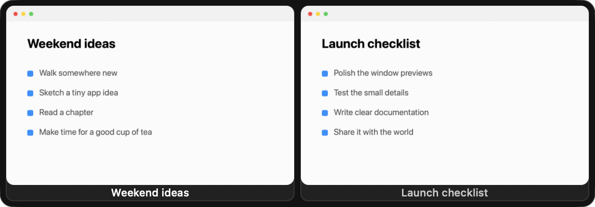
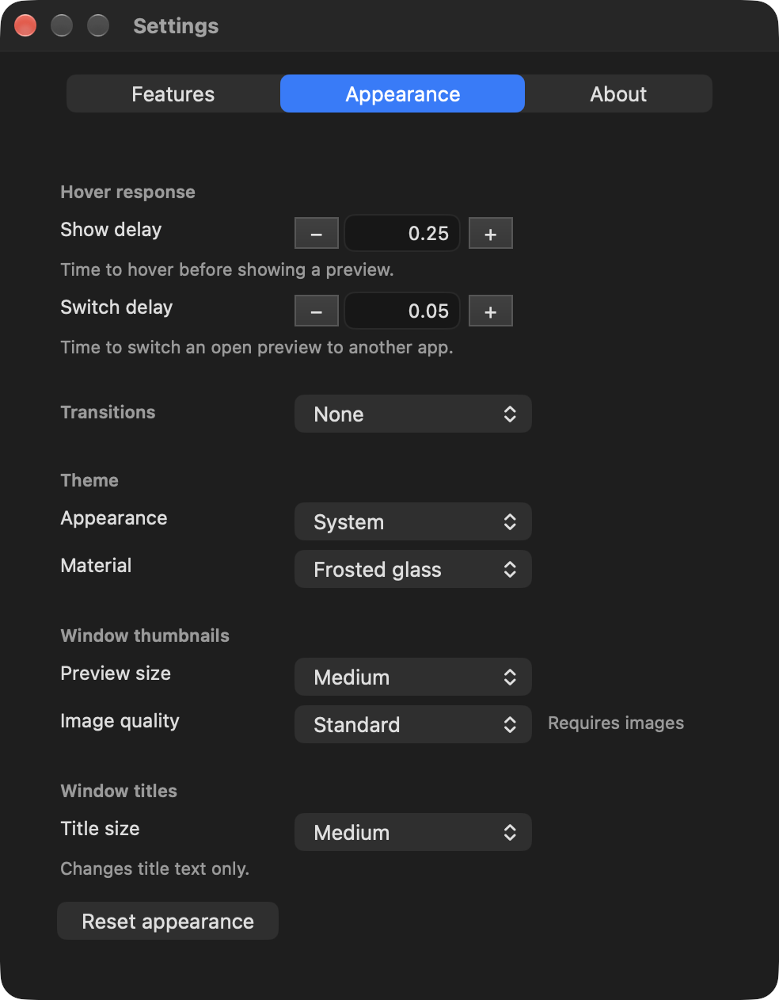
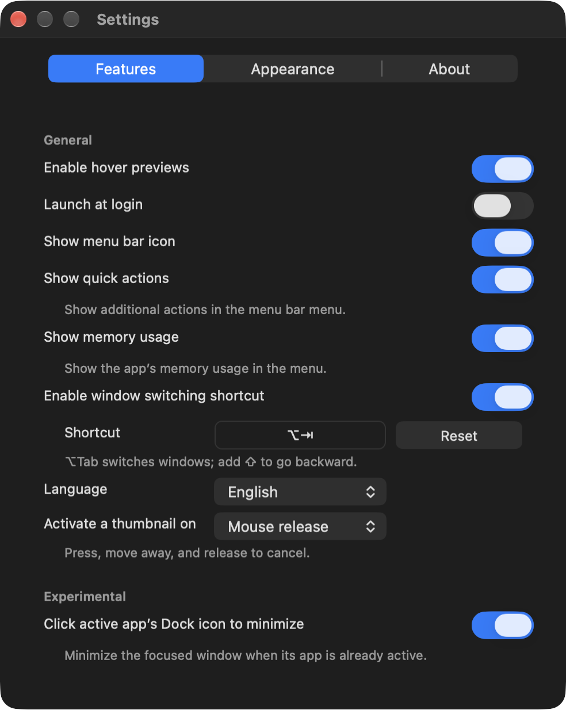
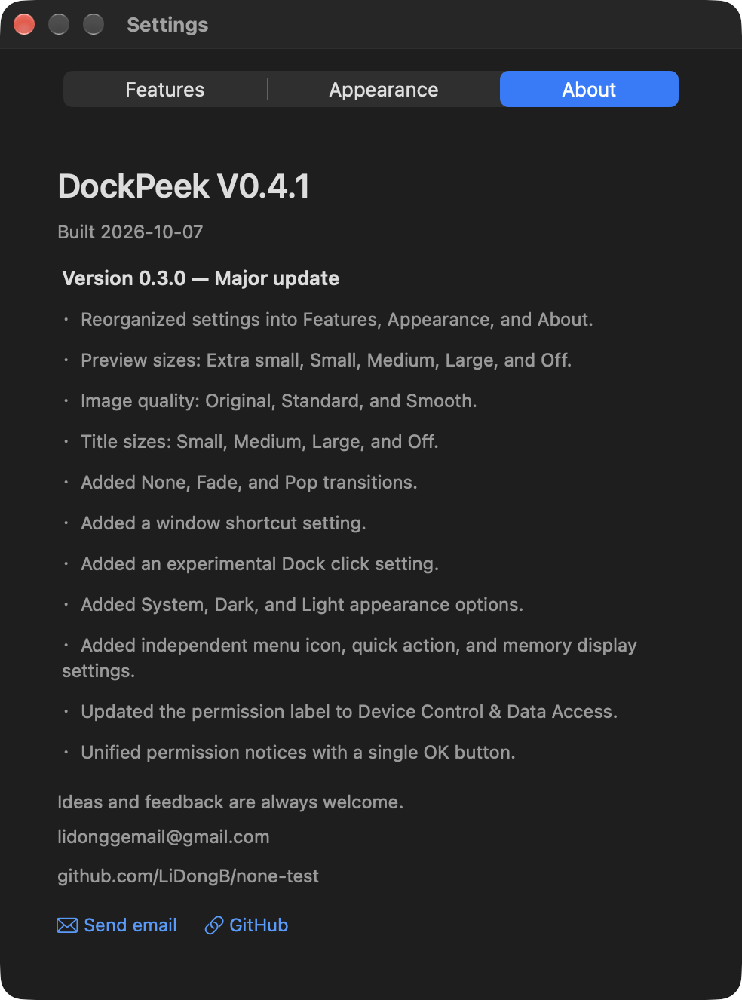

# DockPeek

**Window previews for the macOS Dock.** Hover over an app's Dock icon to see its windows, then select a preview to switch to that window.

DockPeek is a small, local desktop utility written in Swift with AppKit and ScreenCaptureKit. It brings familiar taskbar-style window previews to the Dock, with native macOS controls, configurable appearance, and no third-party runtime dependencies.

[Downloads](#downloads) · [Screenshots](#screenshots) · [Build instructions](#build-and-edit) · [Feedback](#feedback)

## Downloads

1. **[Download the installer — DockPeek V0.4.1](https://github.com/LiDongB/dockpeek/releases/download/v0.4.1/DockPeek-0.4.1.dmg)**  
   Open the disk image and drag DockPeek to Applications.
2. **[Download the editable source](https://github.com/LiDongB/dockpeek/releases/download/v0.4.1/DockPeek-0.4.1-source.zip)**  
   Includes the Swift project, assets, build scripts, and documentation. Open the folder in Codex, another coding tool, or your editor to inspect and modify it.

**Which file should I choose?** Use **DockPeek-0.4.1.dmg** to install DockPeek, or **DockPeek-0.4.1-source.zip** to edit the project. GitHub also automatically lists **Source code (zip)** and **Source code (tar.gz)** on the release page, so four downloads in the Assets section are normal.

See the [release page](https://github.com/LiDongB/dockpeek/releases/tag/v0.4.1) for release notes and checksums.

## Requirements and installation

- macOS 14 or later. Built with the macOS 27 SDK and tested on macOS 27.0.1; older supported systems have not all been tested.
- The downloadable installer contains a universal executable for Apple silicon and Intel Macs. Runtime checks were performed on Apple silicon; Intel was cross-built and has not been tested on physical hardware.
- Liquid Glass requires macOS 26 or later; macOS 27 enables its interactive effect. Earlier systems use frosted material.
- Screen Recording permission provides thumbnails. Accessibility / Device Control and Data Access permission identifies and controls other apps' windows. Names vary by macOS version.

Install in Applications, launch DockPeek, and grant those permissions in System Settings. DockPeek's own notice has one **OK** button that only dismisses the notice. Quit and reopen DockPeek if macOS asks you to restart it after changing permissions.

This build is ad-hoc signed, **not Developer ID signed or notarized**. macOS may require explicit approval for the first launch. If you trust the downloaded project, follow Apple's [instructions for opening an app from an unidentified developer](https://support.apple.com/guide/mac-help/open-a-mac-app-from-an-unknown-developer-mh40616/mac). Do not disable system security protections. Updating or rebuilding may require permissions again.

## Features

- Preview windows by hovering over Dock icons; select a thumbnail to activate its window.
- **Release-to-select by default:** press and release on the same thumbnail to switch. Move away before releasing to cancel. Immediate selection on mouse press is also available.
- Keep the last successful thumbnail when a window is minimized or a capture fails.
- Discover windows on other Spaces and request activation of their existing window and desktop. An unreliable “move this window here” option is not offered.
- Switch windows with a configurable global shortcut; default **Option–Tab**, with **Shift** for reverse cycling.
- Start at login; control the menu bar icon, quick actions, and memory display separately. Reopen DockPeek to reach Settings after hiding its menu bar icon.
- Adjust popup and switching delays, thumbnail size and quality, title size, theme, and material.
- Choose no animation, fade, or pop. Pop dismissal accelerates and hides at its endpoint.
- Use English or Simplified Chinese. English is the default for new installations; existing language choices are preserved.
- Right-click a preview to request **Close all windows of this app** in one action. The target app handles unsaved-document prompts; DockPeek never force-quits it or discards documents.

### Experimental: click the active Dock app to minimize

When enabled, clicking the currently active app's Dock icon minimizes its focused window on the current desktop. This resembles a familiar Windows taskbar interaction. It is off by default and requires window-control permission.

If a window is on another desktop, visiting it takes priority: the same click will not immediately minimize it. Modified clicks, double-clicks, and clicks on unrelated Dock items retain normal behavior.

### Practical limits

Protected content and some apps cannot provide a thumbnail or support every window action. A minimized or off-desktop window may show its last captured image; if no usable image exists, its title remains available. Cross-Space activation uses public macOS APIs and can depend on the target app and Mission Control settings. DockPeek does not use private Space-moving APIs.

Thumbnails stay in memory, are removed when the owning app exits, and can be evicted at the cache's memory or capacity limit. Material appearance also depends on system transparency preferences. Window traffic lights are drawn by macOS.

## Screenshots

These show DockPeek's own interface and synthetic demonstration windows, not private user documents.









## Build and edit

Install Xcode 27 and select its command-line tools. No external package dependencies are needed.

```sh
chmod +x Scripts/make-app.sh
./Scripts/make-app.sh
# Output: dist/DockPeek.app
```

The script reads `VERSION`, targets macOS 14, and uses SwiftPM's native build system so that the compiler's deployment target matches the executable's deployment target. It builds for the current machine's architecture. Set `DOCKPEEK_BUILD_ARCH` to `arm64` or `x86_64` to cross-build where your SDK supports it.

For a debug build and built-in verification:

```sh
./Scripts/make-app.sh debug
dist/DockPeek.app/Contents/MacOS/DockPeek --verify-fixes --out verification-output
```

Verification creates temporary test windows and screenshots, exercises selection cancellation, layouts, materials, caches, numeric controls, shortcuts, and a batch close of its own disposable windows. It restores the preferences it changes. Real multi-desktop and third-party app behavior also needs manual testing on your setup.

## Feedback

[Send email](mailto:lidonggemail@gmail.com) to **lidonggemail@gmail.com**, or open a [GitHub issue](https://github.com/LiDongB/dockpeek/issues).

Bug reports, suggestions, and translation corrections are welcome. Include your macOS version, the affected app, and what you did versus what happened. The author is a Chinese student and a living human, not a bot. Your email goes to that human, who reads the feedback — even if the code-writing team never sleeps.

## The story behind the project

This was my first attempt at programming with AI. Before it, I had almost no programming experience and did not know a programming language. I supplied the ideas, prompts, basic computer-operation knowledge, and testing; AI wrote the code.

I began with DeepSeek and was amazed that I could turn descriptions into a working app. As the project grew, I encountered more frequent small bugs and moved to ChatGPT, which helped fix many of them. In my workflow, ChatGPT also appeared to consume tokens much faster. This is my experience with this project, not a general benchmark of either service.

The initial project took roughly one day and around five to six thousand words of prompting. Further debugging and release preparation followed. The goal has stayed simple: a useful Dock window preview, without turning it into an oversized taskbar replacement.

### AI credits and language notes

All of this program's code was written by AI. Special thanks to ChatGPT and DeepSeek. The human supplied ideas, tested the results, and occasionally asked, “Is it actually fixed this time?”

The author reports primarily using **DeepSeek V4 Flash Max** and **ChatGPT 6.1 Sol** with extra-high reasoning, with some prompts supplied by **ChatGPT 6.1 Ultra**. These are the author's model and configuration labels.

Some project documents, source comments, and build messages are written in Chinese. The app defaults to English, translated with ChatGPT's assistance; translations may be imperfect. Corrections are welcome.

## License

[MIT](LICENSE) — Copyright © 2026 LiDongB.
